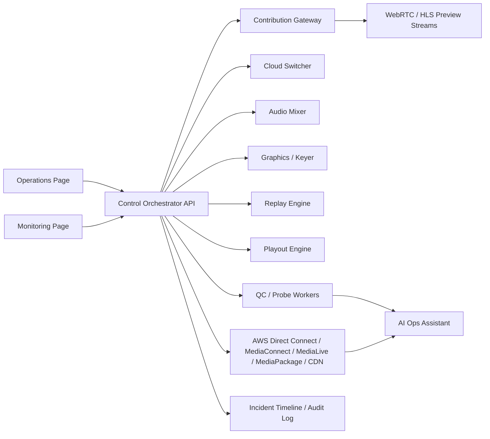

# MCR Studio Client Integration Blueprint

This document explains how MCR Studio should move from browser prototype to client-ready Cloud MCR/PCR control-room platform.

## Product Position

MCR Studio is intended to become a web control surface for hybrid broadcast operations:

- Contribution monitoring: LiveU, NDI, SRT, WebRTC, RTSP, local test media, webcam test sources.
- Production control: preview/program switching, audio follow video, manual audio routing, CG/keyer control, replay, playout, off-air and emergency backup.
- Cloud distribution: transport (Direct Connect or IP), MediaConnect, cloud switcher, MediaLive, MediaPackage/origin, CDN, and primary/backup path monitoring.
- Broadcast NOC: telemetry, QC alarms, incident timeline, operator actions, AI-assisted recommendations.

The browser should not directly perform every media operation. The browser should control and monitor backend services that own real media I/O.

## What Is Real Today

- Static GitHub Pages demo for UI and simulated workflows.
- Node.js Control Orchestrator prototype for shared state, REST commands, logs, and Server-Sent Events.
- FFmpeg contribution preview gateway with real generated/RTMP media processing, HLS preview output, runtime health, slot assignment, and SRT capability detection.
- Browser-side webcam, local video, URL embed preview, Preview, Take, Off Air, graphics overlay simulation, replay/playout simulation, alarms, logs, and AI recommendations.
- Dedicated Operations and Monitoring pages that can run on two displays.

## What Requires Backend Services

Real client integration requires backend workers or cloud services for:

- NDI discovery and conversion to browser-safe WebRTC/HLS previews.
- SRT listener/caller ingest and source health.
- LiveU receiver/API integration.
- RTSP/WebRTC gatewaying.
- FFmpeg/GStreamer preview generation, black/freeze/silence detection, loudness and audio meters.
- Video switcher engine running on CPU/GPU infrastructure.
- Audio mixer engine with AFV, manual mix, PFL, mute, fader, and program bus.
- CG/key/fill renderer or integration with Vizrt, Singular, HTML graphics, CasparCG, or other graphics systems.
- Replay recording, clip creation, clip playback, and return-to-live.
- Playout asset storage, scheduling, slates, filler, and emergency loop playback.
- AWS Direct Connect, MediaConnect, MediaLive, MediaPackage/origin, and CDN status and control APIs.
- Authentication, roles, audit logs, and tenant/client separation.

## Integration Architecture

## Client Discovery Checklist

Before a real integration, collect these details from the client:

- Contribution sources: LiveU model/API access, NDI network details, SRT caller/listener mode, RTSP URLs, WebRTC endpoints, codecs, resolutions, framerates.
- Network: public IPs, firewall/NAT rules, VPN, VLAN/subnet access for NDI, expected latency, bandwidth, redundancy.
- Cloud: AWS account, regions, MediaConnect flows, MediaLive channels, output groups, origins, CDN provider, failover policy.
- Production control: expected switcher behavior, preview/program workflow, transition types, audio-follow-video rules, manual audio override requirements.
- Graphics: graphics provider, key/fill or HTML overlay method, lower thirds, ticker, bug, scorebug, data feeds.
- Replay/playout: recording sources, clip duration, storage, file formats, slate/filler assets, emergency loop behavior.
- QC: alarm thresholds for input loss, silence, black, freeze, packet loss, high RTT, CDN degraded, loudness.
- Security: users, roles, SSO, audit policy, API credentials, secret storage, customer data retention.
- Operations: runbooks, escalation contacts, failover SOP, incident report format.

## Recommended Build Phases

### Phase 1: Client Demo Hardening

- Keep GitHub Pages as public UI demo.
- Keep `npm start` backend mode for two-screen shared state.
- Add realistic scenarios for football/live event, failover, ad cue, silence, black, CDN degradation.
- Create a client demo script and architecture slide.

### Phase 2: Gateway Pilot

- Build a small gateway service for one real input type first, preferably SRT or NDI.
- Expose `/api/sources`, `/api/source/:id/preview`, and source-health events.
- Convert preview to browser-safe WebRTC or HLS.
- Feed real QC data into Monitoring.

### Phase 3: Real Control Plane

- Move all Preview, Take, Off Air, audio, graphics, replay, playout, alarms, and logs into the backend orchestrator.
- Add authentication, operator roles, audit trail, and persistent incident timeline.
- Add WebSocket or SSE event bus for live updates.

### Phase 4: Production Media Engines

- Connect switcher, audio mixer, graphics, replay, playout, encoder, and cloud delivery services.
- Add active/backup deployment, health checks, and disaster recovery.
- Deploy with Docker and later Kubernetes or managed cloud services.

## Domain And Hosting Recommendation

Do not buy a domain only for the current static prototype. Buy or configure a domain when the hosted backend/API plan is clear.

Recommended future structure:

- `studio.example.com`: browser UI.
- `api.example.com`: Control Orchestrator API.
- `gateway.example.com`: contribution preview gateway.
- `status.example.com`: public/internal service health page.

For client pilots, use a branded subdomain only after HTTPS, authentication, API hosting, and secret handling are ready.

## Near-Term Next Build

The most valuable next engineering step is a real source gateway proof of concept:

1. Pick one input type: SRT or NDI.
2. Build a small backend process that discovers/accepts the source.
3. Generate a browser preview stream.
4. Publish source health and QC events to the orchestrator.
5. Route that real source through the existing Preview/Program UI.

That turns MCR Studio from a polished simulation into a genuine cloud broadcast operations prototype.
